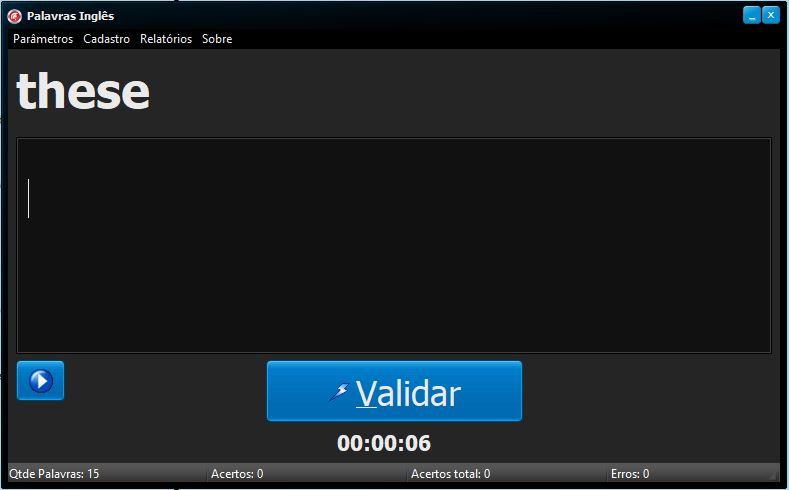

# ProjetoTreinamentoIngles
## Projeto criado para treinar desenvolvimento Delphi utilizando os seguintes recursos:
<ul>
  <li>Arrays</li>
  <li>Listas de objetos</li>
  <li>Combobox de objetos</li>
  <li>Radiobutton de objetos</li>
  <li>ChecklistBox de objetos</li>
  <li>Recurso do TMediaPLayer</li>
  <li>SAPI.SpVoice</li>
  <li>Emissão de relatorios usando RDPRINT</li>
  <li>Conexao com banco de dados Firebird 3.0</li>
  <li>Inserções, atualizações, exclusões e consultas em banco de dados</li>
  <li>Geração e exportação de arquivo xml</li>
  <li>Importação de arquivo xml</li>
  <li>Barra de progresso</li>
  <li>Timer</li>  
</ul>

## Instalação de componentes para execução do projeto

Para abrir e rodar o projeto na IDE sem erros é necessário:

<ul>
  <li>Usar o Delphi XE2</li>
  <li>Tera biblioteca de conexão com banco de dados ZEOS e o componente de emissão de relatórios RDPRINT.</li>
  <li>Instalar o Firebird 3.0.</li>
  <li>Ter o seguinte diretório na máquina: "C:\Ingles\Banco". Caso contrário é necessário alterar o caminho do banco no componente ZCONECTION.</li>
  <li>O banco de dados que consta neste projeto do GitHub deve estar no diretório especificado acima.</li>
</ul>

## Execução do aplicativo sem necessidade do Delphi

Para rodar o projeto apenas para ver sua execução é necessário:

<ul>
  <li>Ter o seguinte diretório na máquina: "C:\Ingles\Banco".</li>
  <li>Copiar o arquivo do seguinte diretório deste projeto do GitHub: "ProjetoTreinamentoIngles/Banco/BANCO.FDB" e colocar no diretório "C:\Ingles\Banco".</li>
  <li>Copiar o arquivo do seguinte diretório deste projeto do GitHub: "ProjetoTreinamentoIngles/Win32/Debug/Principal.exe" e colar no diretório "C:\Ingles\Banco".</li>
  <li>Instalar o Firebird 3.0.</li>
  <li>Executar o arquivo Principal.exe</li>
</ul>

## Imagem tela principal

## Funções do Programa

<li>Permitir o cadastro de palavras em inglês e suas respectivas traduções em português</li>
<li>Permitir o cadastro de frases em inglês e suas respectivas traduções</li>
<li>Validar se a palavras exibida aleatoriamente em tela representa sua tradução conforme palavras digitadas pelo usuário</li>
<li>Transmitir som atraves de voz do programa (SAPI.SpVoice) as palavras em inglês exibidas em tela</li>
<li>Permitir diversas configurações para flexibilizar a forma de estudo</li>
<li>Permitir que o usuário verifique o tempo que o mesmo demorou para acertar todas as palavras/frases do estudo proposto</li>
<li>Permitir a impressão de relatórios que auxiliam no entedimento de como estão os estudos do momento</li>
